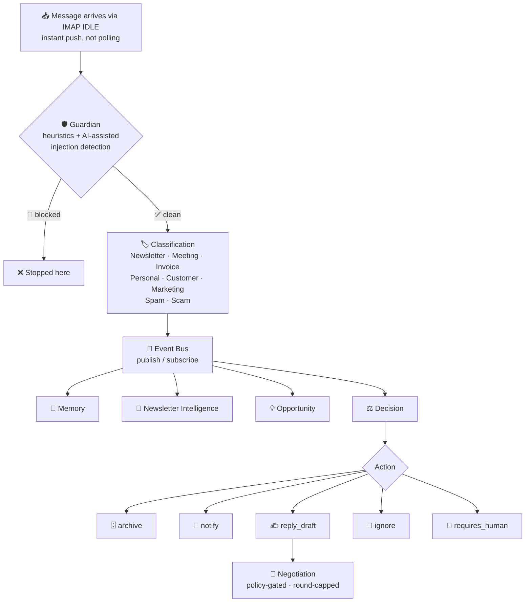

# 📬 MailOS

**An open-source AI communication runtime**

> ✉️ Email was built for humans. **MailOS** is built for AI agents to communicate *on behalf of* humans — reading, negotiating, and reaching agreements over ordinary email, and only interrupting the owner when their judgment is actually needed.

Think of MailOS as an operating system that sits on top of a mailbox: instead of you opening your inbox and manually triaging, replying, and following up, a team of specialized agents does that work continuously in the background, escalating to you only for the handful of decisions that actually need a human.

MailOS connects to a mailbox, listens 24/7, and gets straight to work:

- 🛡️ Guards against phishing & prompt injection
- 🏷️ Classifies and responds to incoming mail
- 🤝 Negotiates autonomously within a policy you set
- 📰 Learns from newsletters
- 💡 Surfaces business opportunities hiding in your inbox

⚡ Powered end-to-end by **Qwen**.
📄 MIT licensed · 🧩 Designed to be embedded into any application.

---

## 🚀 Quick Start

```bash
npm install
cp .env.example .env
# ✍️ edit .env: set QWEN_API_KEY at minimum
npm start
```

Open `http://localhost:4000` in your browser. 🎉 First run shows a one-time setup page to create your admin account — after that, it's a normal login.

### 🔑 Getting a Qwen API Key

1. 🌐 Go to the Alibaba Cloud Model Studio console (DashScope): https://bailian.console.aliyun.com/
2. 👤 Sign in with (or create) an Alibaba Cloud account.
3. 🗝️ Open **API-KEY Management** and create a new key.
4. 📋 Paste it into `.env` as `QWEN_API_KEY`, or into **Settings → Qwen provider** in the running app — the latter takes effect immediately, no restart needed. ⚡

---

## 🏗️ Architecture



Every agent is **independent** and talks **only** through the internal event bus — publish/subscribe, never direct agent-to-agent calls. 🔌 The bus runs on real BullMQ-backed Redis queues when `REDIS_URL` is set, and an in-process equivalent otherwise — both paths run the identical pipeline.

### 🤖 The Pipeline Agents

| Agent | Responsibility |
|---|---|
| 🛡️ **Guardian** | Blocks phishing, malicious attachments, and prompt injection — heuristics first (instant, zero cost), then an AI-assisted semantic check for attempts no fixed pattern anticipated. Degrades to heuristics-only if the AI call fails; never depends on AI availability to keep working. |
| 🏷️ **Classification** | Multi-label classification with confidence scores. Bulk mail that doesn't cleanly fit a category (unsubscribe links, "view in browser" banners) falls back to Newsletter rather than a dead-end Uncategorized, so it still feeds the knowledge pipeline. |
| 🧠 **Memory** | Recency + importance + relevance retrieval (the same three-factor family as the Stanford "Generative Agents" memory-stream design), reinforcement on recall, and hierarchical consolidation into higher-level reflections. |
| 📰 **Newsletter Intelligence** | Reads newsletters, safely visits links/PDFs, extracts ideas/trends/stats, and detects when independent sources converge on the same topic. |
| 💡 **Opportunity** | Mines newsletter insights and customer emails for business opportunities and recurring pain points. |
| ⚖️ **Decision** | Assigns one of five actions with a confidence score and a plain-language reason. |
| 🤝 **Negotiation** | Autonomous multi-round negotiation, policy-gated (see below). |

📎 Connecting a mailbox is the *only* step — monitoring starts immediately via IMAP IDLE, and a bounded history sync runs automatically so MailOS has something to reason about from minute one, not just mail from that point forward.

---

## 🤝 Autonomous Negotiation

Two mailboxes — or one MailOS-connected mailbox talking to any ordinary inbox — can carry out an **entire negotiation** without the owner reading a single intermediate message. 📭 No special protocol: MailOS negotiates in plain natural-language email, threaded via standard RFC 5322 headers, so it works with any correspondent's normal inbox.

🧭 **The AI proposes, policy decides.** Every autonomous reply is checked against a deterministic, code-enforced policy — max discount %, an approval threshold above a given amount, a confidence floor — before anything is sent. Two independent circuit breakers 🚦 stop a negotiation from running away: a hard round cap, and the policy/confidence gate. Either one hands the conversation to a human via webhook (Telegram, Slack, Discord, or any endpoint) instead of continuing.

The owner isn't consulted every round — that would defeat the point. MailOS only reaches out once, when something genuinely can't be resolved on its own. 🙋

**🎯 Owner-initiated negotiation:** define a goal, MailOS sends the opening move:

```bash
curl -X POST localhost:4000/negotiations -H "Content-Type: application/json" -d '{
  "mailboxId": "...", "to": "seller@example.com",
  "subject": "Purchasing your software license",
  "intent": { "type": "purchase", "goal": "Buy a 50-seat license",
              "constraints": { "maxPrice": 5000, "preferredPaymentTerms": "net-30" } }
}'
```

**📅 Calendar-aware meeting scheduling:** for `Meeting`-classified mail, availability is checked deterministically against a mailbox's configured calendar (Settings → mailbox profile) — not guessed by the AI. The AI communicates the verified result, it doesn't invent it. ✅

**📊 Efficiency, measured not claimed:** every round records its real token usage (from Qwen's own API response) and wall-clock time. `GET /negotiations/:id` returns a computed efficiency block comparing autonomous handling against a stated single-agent baseline.

---

## 🔒 Reliability

- ⚡ **Real-time, not polled** — IMAP IDLE (via `imapflow`) means new mail is picked up the instant it arrives, no restart or manual sync required.
- 🔁 **Reconnects itself** — both the database connection and every mailbox's IMAP connection retry with exponential backoff on a drop, at boot and mid-session.
- 💾 **Embedded, durable storage** (`@seald-io/nedb`) — no separate database server to install, run, or lose. Scales to real MongoDB (`MONGODB_URI`) if you need multi-server horizontal scaling.
- 📝 **Full audit trail** — every significant failure is logged with context and queryable at Settings → Recent errors.
- 🧭 **Clear, actionable errors** — a failed mailbox connection tells you exactly what's wrong, not a raw stack trace.

---

## 🛡️ Security

- 🔐 **API key or session auth on every route.** The browser UI uses a signed session cookie from username/password login; external clients use `API_KEYS`. Neither is optional.
- 🚫 **Login lockout** — 3 failed attempts blocks that IP+browser fingerprint for 15 minutes. Blocks live in `data/login-blocks.json`, editable directly or via Settings → Login security.
- 🐢 **Rate limiting** on every route, stricter on anything that sends real email or spends real AI tokens.
- 🔒 **Encrypted credentials** — mailbox passwords are AES-256-GCM encrypted before they're ever written to disk.
- 🧱 **Content Security Policy** enforced via Helmet, zero inline event handlers anywhere in the UI.
- ✅ **Zero known vulnerabilities** — every dependency runs on its latest maintained major version (`npm audit` clean).

---

## ☁️ Deploying to Alibaba Cloud (ECS)

1. **🖥️ Create the instance.** In the Alibaba Cloud ECS console, launch an instance — Ubuntu 22.04 LTS, 2 vCPU / 4 GB RAM is comfortable for a single-instance deployment. Attach a public IP.
2. **🔓 Open the security group.** Allow inbound TCP on 22 (SSH) and 443/80 (or your chosen app port).
3. **🔧 SSH in and install Node.js:**
   ```bash
   ssh root@<your-ecs-public-ip>
   curl -fsSL https://deb.nodesource.com/setup_22.x | bash -
   apt-get install -y nodejs git
   ```
4. **📦 Get the code onto the server** — clone your repo (recommended, since it powers the in-app update checker) or upload the zip:
   ```bash
   git clone <your-repo-url> mailos && cd mailos
   npm install --omit=dev
   ```
5. **⚙️ Configure environment:**
   ```bash
   cp .env.example .env
   nano .env   # set QWEN_API_KEY, ENCRYPTION_KEY, JWT_SECRET, API_KEYS, NODE_ENV=production
   ```
6. **♻️ Run it under a process supervisor** (required for auto-restart, including in-app updates):
   ```bash
   npm install -g pm2
   pm2 start src/index.js --name mailos
   pm2 save
   pm2 startup   # follow the printed instructions so MailOS survives a reboot
   ```
7. **🔐 Put it behind Nginx + HTTPS** (recommended so session cookies are sent over TLS):
   ```bash
   apt-get install -y nginx certbot python3-certbot-nginx
   # point an Nginx server block's proxy_pass at http://127.0.0.1:4000
   certbot --nginx -d your-domain.com
   ```
8. 🌍 Visit `https://your-domain.com`, complete the first-run setup, and connect a mailbox.

📁 `data/` (mailboxes, memory, negotiations) lives outside the git-tracked source, so `git pull && npm install && pm2 restart mailos` — or the in-app **Update now** button — never touches it. 🙌

---

## ✨ Features Available Now

- 📬 Multi-mailbox IMAP/SMTP connector, any provider, real-time IMAP IDLE
- 🛡️ Guardian: heuristic + AI-assisted phishing/injection/malware defense
- 🏷️ 8-label classification with a newsletter fallback for bulk mail
- 🧠 Recency+importance+relevance memory with hierarchical consolidation
- 🤝 Autonomous, policy-gated, round-capped negotiation
- 🎯 Owner-initiated negotiation (define a goal, MailOS sends the opening move)
- 📅 Calendar-aware meeting scheduling, deterministic availability checks
- 📰 Newsletter intelligence + cross-source trend detection
- 💡 Opportunity mining from newsletters and customer email
- 🧾 Mailbox profiles: calendar, priorities, location, freeform preferences, reference documents
- 💾 Data backup/export per mailbox or instance-wide, credentials always excluded
- 🔌 Full REST API, session or API-key auth, per-route rate limiting, login lockout
- 🌗 Light/dark themed web UI, mobile responsive
- 🛠️ Live-editable settings (Qwen key/model/endpoint, negotiation policy) — no restart
- 🔄 In-app update checker against GitHub releases, one-click update, data untouched
- 🗄️ Embedded zero-setup storage, optional MongoDB; embedded event bus, optional Redis/BullMQ

## 🗺️ Milestones

- 🧠 **Memory export/import** — export an agent's full memory stream (raw events + hierarchical reflections) to a file, and import it into a new instance for migration, staging, or handoff, with point-in-time snapshots for audit.
- 🕸️ **Cross-mailbox trust graph** — a local reputation score per contact, built from every past negotiation and correspondence across all threads and mailboxes, applied automatically at the policy level.
- 📞 **Voice escalation bridge** — when an email negotiation stalls, MailOS autonomously places an outbound voice call under the same policy guardrails, then writes the outcome back into the email thread.
- 💸 **Agent-to-agent payments** — letting one MailOS instance pay another to close a negotiated deal, gated behind strict, explicit, per-transaction owner-approved limits.
- 👥 **Multi-user / team accounts** — currently single-admin per instance.
- 🔗 **More connectors** — Slack, GitHub, Calendar, CRM, WhatsApp Business, all through the same `ConnectorInterface` email already implements.
- 📈 **Real vector index at scale** — for memory/document search well beyond the embedded store's comfortable range.
- 🏋️ **Load-tested concurrency** — many simultaneous negotiations across many mailboxes.

## 📂 Folder Structure

```
src/
  core/          EventBus, AgentBase, Orchestrator, ConnectorRegistry, Logger, topics
  connectors/    ConnectorInterface, EmailConnector
  providers/     ProviderInterface, QwenProvider, ProviderManager
  repositories/  RepositoryInterface, NeDbRepository (default), MongoRepository (optional)
  agents/        Guardian, Classification, Memory, NewsletterIntelligence, Opportunity, Decision, Negotiation, QA
  services/      DashboardService, SettingsService, AuthService, LoginGuard, ErrorLogService, NotificationService
  api/           Fastify server, security (auth), routes
  utils/         security, vector/memoryScoring, calendarAvailability, emailThreading, retry, passwords
public/          Web UI — plain HTML/CSS/JS, no build step
```

## 🧩 Extending MailOS with a New Connector

1. 🏗️ Create `src/connectors/YourConnector.js` extending `AgentBase` and implementing `ConnectorInterface` (`connect`, `disconnect`, `startMonitoring`, `sync`, `send`).
2. 🔄 Normalize incoming payloads into the same shape `EmailConnector.ingest()` uses and publish onto the event bus the same way.
3. 📝 Register it in `src/core/Orchestrator.js`: `this.connectors.register(new YourConnector())`.
4. ✅ Every existing agent picks it up automatically — they only ever see the generic message shape, never the connector that produced it.

---

<p align="center">Made with 🧠 + ✉️ + Qwen</p>